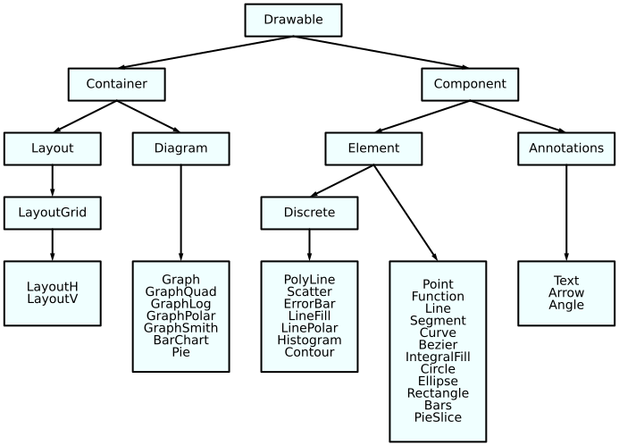

Introduction
============

Installation
------------

Ziaplot can be installed using pip:

.. code-block:: bash

    pip install ziaplot

For the optional cairosvg dependency (for saving images in formats other than SVG), install using:

.. code-block:: bash

    pip install ziaplot[cairosvg]

Or to enable LaTeX math expression rendering (via `ziamath <https://ziamath.readthedocs.io>`_), install using:

.. code-block:: bash

    pip install ziaplot[math]

|

Quick Look
----------

.. jupyter-execute::
    :hide-code:

    import math
    import ziaplot as zp
    zp.css('Canvas{width:300;height:300;}')

Diagrams are built using a descriptive Python syntax, such that plotting geometric
figures does not require discretizing the figure into an array of (x, y) pairs.

.. jupyter-execute::
    :hide-code:

    zp.css('Canvas{width:300;height:300;}')

.. jupyter-execute::

    import ziaplot as zp

    with zp.GraphQuad().xrange(-4, 4).yrange(-4, 4):
        line1 = zp.Line.from_slopeintercept(slope=0.25, intercept=1)
        line2 = zp.Line.from_slopeintercept(slope=-2, intercept=3)
        zp.Point.at_intersection(line1, line2)
        zp.Angle(line1, line2).label('θ')

|

Discrete data may just as easily be plotted:

.. jupyter-execute::

    x = [1, 2, 3, 4, 5]
    y = [0, .4, 1.2, 1.0, 1.4]
    with zp.Graph():
        zp.PolyLine(x, y)

|

Simple style modifications may be made with chained methods:

.. jupyter-execute::

    with zp.Graph():
        zp.PolyLine(x, y).color('green').marker('round')

|

or use the CSS-like :ref:`styling system<Styling>` for full control of plotting styles:

.. jupyter-execute::

    css = '''
        Graph {
            color: #EEEEFF;
        }
        PolyLine {
            color: blue;
            stroke_width: 4;
        }
    '''
    with zp.Graph().css(css):
        zp.PolyLine(x, y)

|

Geometric diagrams without axes can also be created:

.. jupyter-execute::

    with zp.Diagram().css(zp.CSS_BLACKWHITE):
        circle = zp.Circle((0, 0), 1)
        zp.Point((0, 0))
        r1 = circle.radius_segment(0)
        r2 = circle.radius_segment(45)
        zp.Angle(r1, r2, quad=4).label('α')

|

Bar charts and pie charts may be created from dictionaries or lists of the slice values:

.. jupyter-execute::
    :hide-code:

    zp.css('Canvas{width:350;height:300;}')

.. jupyter-execute::

    zp.Pie.fromdict({'Dogs':4, 'Cats':3, 'Birds':1, 'Gerbils': .5}).legend('none')

.. jupyter-execute::

    zp.BarChart.fromdict({'Dogs': 4, 'Cats': 3, 'Birds': 1, 'Gerbils': .5})

|

Multiple diagrams may be combined into one image using horizontal, vertical, or grid layouts.

.. jupyter-execute::

    with zp.LayoutH().size(600, 300):
        zp.BarChart.fromdict({'Dogs': 4, 'Cats': 3, 'Birds': 1, 'Gerbils': .5})
        zp.Pie.fromdict({'Dogs': 4, 'Cats': 3, 'Birds': 1, 'Gerbils': .5}).legend('none')

|

Concepts and Nomenclature
-------------------------

Classes in ziaplot are structured as follows.
Refer to this diagram for applying styles. For example, apply a style
to "Annotation" to change the properties of all text, arrows, and angles.

The ziaplot documentation (and code) uses these definitions:

* **Drawing**: The entirety of an image, which may consist of one or more Diagrams.
* **Diagram**: a surface to draw on as one section of a complete Drawing.
* **Graph**: A Diagram with axes for locating data coordinates
* **Chart**: A Graph with qualitative x-coordinates (Pie and Bar are Charts)
* **Element**: An object, made of points, lines, or planes, drawn within a Diagram to represent geometric figures or data
* **Annotation**: Text, arrows, etc., used to provide additional information
* **Plot**: A verb, meaning locate and draw objects in a Diagram.
* **Axis**: A line used for orienting space
* **Axes**: Plural of Axis, usually meaning the x-axis and y-axis together
* **Figure**: A geometric form consisting of points, lines, planes

Why another plotting library?
-----------------------------

Anyone who has been around Python long enough should be familiar with Matplotlib, the de facto standard for data visualization with Python.
Matplotlib is powerful and flexible - it can plot anything.
However, it was designed for plotting empirical data in the form of arrays of x and y values, so graphing true mathematical functions or
geometric figures (lines, circles, segments, curves, etc.) typically becomes a chore of discretizing the function or shape into an array first.

Additionally, Matplotlib has a confusing, non-Pythonic programming interface.
What's the difference between a `figure()` and `Figure()`?
Why does documentation sometimes use `plt..`, sometimes `ax..`, and sometimes the awful `from pylab import *`?
It is also a huge dependency, requiring Numpy libraries and usually bundling several UI backends along with it.
A simple Tkinter UI experiment (see :ref:`ziagui`), built into an executable with Pyinstaller, was 25 MB when the data was plotted with Ziaplot, but over 500 MB using Matplotlib!
There are some Matplotlib alternatives. Seaborn just wraps Matplotlib to improve its interface. Plotly and Bokeh focus on interactivity and web applications.

Ziaplot was created as a light-weight, easy to use, fast, and Pythonic library for making static diagrams and graphs in SVG format,
while treating mathematical functions and geometric figures as first-class citizens.
