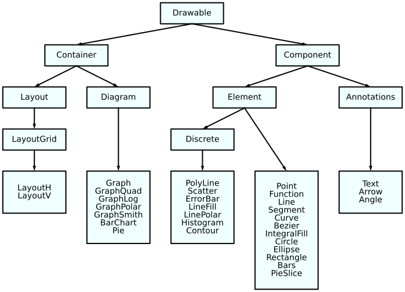

.. _Styling:

Styling
=======

.. jupyter-execute::
    :hide-code:

    import math
    import ziaplot as zp
    zp.css('Canvas{width:300;height:300;}')

Styles, such as colors, sizes, linewidths, and strokes, are set using a CSS-like
style system.
Every drawable object, including Diagrams, Graphs, and the objects added to them,
use the same basic set of style attributes.
Not all items use every attribute when being drawn.

.. _styleattributes:

Style Attributes
----------------

* color: color of the line or fill-color of a shape. May be:
    - A hex color `"#FFFFFF"`
    - A hex color with alpha `"#FFFFFFFF"`
    - A rgb or rgba color `"rgba(255, 0, 255, .5)"`
    - A `CSS named color <https://developer.mozilla.org/en-US/docs/Web/CSS/named-color>`_, such as `"red"` or `"lightsalmon"`
    - A CSS named color with transpacency as percent `"red 50%"`
* edge_color: edge color of shapes and markers. Same format as `color`.
* stroke: The stroke style of lines. Options are:
    - `-` (solid line)
    - `dotted` (or `:`)
    - `dashed` (or `--`)
    - `dashdot` (or `-.` or `.-`)
    - A space separated SVG `stroke-dasharray <https://developer.mozilla.org/en-US/docs/Web/SVG/Attribute/stroke-dasharray>`_
* stroke_width: Line width of the stroke
* shape: shape of markers and points. Options are:
    - `round` (or `o`)
    - `square` (or `s`)
    - `triangle` (or `^`)
    - `triangled` (or `v`)
    - `larrow` (or `<`)
    - `arrow` (or `>`)
    - `+`
    - `x`
    - `-`
    - `|`
    - `||`
    - `|||`
* radius: Radius of markers, points, arrowheads
* edge_width: Line width of border around markers, bars, pie slices
* font: Font family of text
* font_size: Font size of text
* num_format: `string formatter <https://docs.python.org/3/library/string.html#format-specification-mini-language>`_ for floating point values
* height: Pixel height of canvas, tick marks
* width: Pixel width of canvas and colorbar
* margin: Pixel spacing between objects such as legend-axis, text-line, bar-bar, etc.
* pad: Pixel spacing from edge to contents within a container (such as legends, canvas)
* colorcycle: List of colors to cycle through in a graph 

.. tip::

    Providing a color attribute of `C1`, `C2`, etc. will use the first, second, etc.
    color in the colorcycle.

Single instance styling
-----------------------

To apply styling to a single instance of a ziaplot component, use its `.style` method.
Provide a string in the form of 'name: value; name2: value2;'.

.. jupyter-execute::

    with zp.Graph():
        zp.Line((0,0), .5).style('color: orange; stroke_width: 4;')
        zp.Line((0,0), 1).style('color: blue; stroke: dashed;')
        zp.Line((0,0), 2)  # Reverts to default (cherry red) style

Class-based styling
-------------------

Often, styles will be applied to all objects of a class, for example to make
all Line instances have the same color and width, without adding styles to each
line individually.

To accomplish this, a CSS string is created, with the name of the component and
attributes to apply inside curly braces.

.. jupyter-input::

    css = '''
    Component {
        name: value;
        name: value;
    }
    '''

The css string is added to a container (usually either a Layout, Diagram, or Graph instance)
using the `css` method.

.. jupyter-execute::

    css = '''
    Line {
        stroke_width: 4;
        color: black
    }
    '''
    with zp.Graph().css(css):
        zp.Line.from_slopeintercept(.5, 0)
        zp.Line.from_slopeintercept(1, 0)
        zp.Line.from_slopeintercept(2, 0)

Note all Line objects inherit this style from the Graph's CSS. However, 
local styling on each instance itself overrides the Graph's style.

.. jupyter-execute::

    with zp.Graph().css(css):
        zp.Line.from_slopeintercept(.5, 0)
        zp.Line.from_slopeintercept(1, 0)
        zp.Line.from_slopeintercept(2, 0).style('color: red;')

Inheritance
***********

Class-based styles are inherit from parent classes. Refer to this diagram.
For example, `colorcycle` is often set on the `Element` class to apply to
all non-annotation elements added to a Diagram.

Subclasses
**********

Some classes have sub-components that may be styled.

* **Graph.GridX**: Color and Stroke of X Gridlines. Set "color: none;" to remove.
* **Graph.GridY**: Color and Stroke of Y Gridlines. Set "color: none;" to remove.
* **Graph.Title**: Font of title
* **Graph.XName**: Font of x-axis caption
* **Graph.YName**: Font of y-axis caption
* **Graph.Legend**: Legend style, including `color` (background), `edge_color` (frame), `stroke_width` (border), `margin` (between legend and axis), `pad` (between border and contents)
* **Graph.LegendText**: Legend font style
* **Graph.TickX**: Font and style of x-axis tick marks, including `height` (tick length), `margin` (text to tick), `pad` (stretch the datarange by this fraction of a tick)
* **Graph.TickY**: Font and style of y-axis tick marks, including `height` (tick length), `margin` (text to tick), `pad` (stretch the datarange by this fraction of a tick)
* **Graph.TickXMinor**: Style of minor tick marks on x-axis
* **Graph.TickYMinor**: Style of minor tick marks on y-axis
* **Smith.Grid**: Style of grid lines on Smith chart. Set "color: none;" to remove.
* **Smith.GridMinor**: Style of minor grid lines on Smith chart. Set "color: none;" to remove.
* **BarChart.TickX**: Font and style of tick marks on BarCharts.
* **BarChart.TickY**: Font and style of tick marks on BarCharts.
* **BarChart.GridX**: Grid Lines on BarChart
* **BarChart.GridY**: Grid Lines on BarChart
* **BarChartHoriz.GridX**: Grid Lines on BarChartHoriz
* **BarChartHoriz.GridY**: Grid Lines on BarChartHoriz
* **PieSlice.Text**: Font and style of text labels for pie slices
* **ErrorBar.MarkerYError**: Marker for y-error bars
* **ErrorBar.MarkerXError**: Marker for x-error bars
* **Contour.ColorBar**: Colorbar style, including `width`, `margin`
* **Point.Text**: Font and style for Point labels
* **Point.GuideX**: Style for Point guide lines
* **Point.GuideY**: Style for Point guide lines
* **Angle.Text**: Font and style for angle labels

For example, to style every Graph title to red:

.. jupyter-input::

    css = '''
    Graph.Title {
        color: red;
    }
    '''
    zp.css(css)

Comments
********

Comments are included in CSS strings using `/* ... */`:

.. jupyter-input::

    css = '''
    Element {
        colorcycle: black;  /* no color cycling - every element is black */
    }
    '''

|

Global styling
--------------

CSS style strings may be applied globally to all ziaplot instances by using
:py:func:`ziaplot.style.themes.css`.

.. jupyter-input::

    zp.css(css)

CSS ID and CSS Class Styling
----------------------------

Just as in web-based CSS, ziaplot's CSS can apply to elements with 
a name or "class" (not to be confused with a Python class).

Selectors in the CSS string starting with `#` will apply
to elements with the same name set on the element using the `cssid` method.
Selectors in the CSS string starting with `.` will apply
to elements with the same name set on the element using the `cssclass` method.

.. jupyter-execute::

    css = '''
    #diameter {
        color: blue;
        stroke: dotted;
        stroke_width: 4;
    }
    .reddot {
        color: red;
        radius: 6;
    }
    '''
    with zp.Diagram().css(css):
        c = zp.Circle(0, 0, 1)
        zp.Point.on_circle(c, 0).cssclass('reddot')
        zp.Point.on_circle(c, 15).cssclass('reddot')
        zp.Point.on_circle(c, 30).cssclass('reddot')
        zp.Point.on_circle(c, 45)
        zp.Point.on_circle(c, 60)
        zp.Point.on_circle(c, 75)
        c.diameter_segment(-15).cssid('diameter')

Pre-made CSS
------------

Some style changes are very common, so ziaplot provides pre-formed CSS.
Because these are strings, they may be chained together in a call to `css()`
using the `+` operator.

* zp.CSS_BLACKWHITE: Draw all components as black
* zp.CSS_NOBACKGROUND: Remove the (usually light gray) background fill
* zp.CSS_NOGRID: Remove grid lines

.. jupyter-execute::

    with zp.LayoutH().size(400, 200):
        zp.Graph()
        zp.Graph().css(zp.CSS_NOBACKGROUND+zp.CSS_NOGRID)

|

.. _themes:

Themes
------

A number of predefined styles (themes) are built-in to Ziaplot.

List the theme names with :py:func:`ziaplot.style.themes.theme_list`

.. jupyter-execute::

    zp.theme_list()

To enable the "taffy" theme for all plots, use:

.. code-block:: python

    zp.theme('taffy')

The available themes are shown below.

.. jupyter-execute::
    :hide-code:

    zp.css('Canvas{width:600;height:400;}')

    def teststyle():
        p = zp.Pie().fromdict({'a':3, 'b':2, 'c':3, 'd':2, 'e':4, 'f':2}).legend('none')
        p2 = zp.GraphQuad()
        p2 += zp.Function(lambda x: x**2, (-.9, .9)).endmarkers()
        p2 += zp.Function(lambda x: x**3/2, (-.9, .9)).endmarkers()
        p2 += zp.Function(lambda x: -x**4/20, (-.9, .9)).endmarkers()

        x = zp.linspace(10, 20, 10)
        y = [math.exp(xi/10) for xi in x]
        p3 = zp.Graph()
        p3 += zp.PolyLine(x, y).marker('round')
        p3 += zp.Scatter(x, [yi*2 for yi in y]).marker('square')
        p3 += zp.PolyLine(x, [yi*4 for yi in y]).marker('arrow', orient=True)
        p3 += zp.PolyLine(x, [yi*3 for yi in y]).stroke('--')

        p4 = zp.BarChartGrouped(groups=('a', 'b', 'c', 'd'))
        p4 += zp.BarSeries(2, 2, 4, 3)
        p4 += zp.BarSeries(2, 3, 1, 4)

        fig = zp.LayoutGrid(p3, p4, p2, p, columns=2)
        return fig

    def test_gradientstyle():
        xf = zp.linspace(0, 10, 10)
        x = y = zp.util.zrange(-2., 3., .1)
        z = [[2 * (math.exp(-xx**2 - yy**2) - math.exp(-(xx-1)**2 - (yy-1)**2)) for xx in x] for yy in y]

        with zp.LayoutH().size(600,300):
            with zp.Graph():
                for i in range(12):
                    yf = [xi*(i+1) for xi in xf]
                    zp.PolyLine(xf, yf)
            
            with zp.Graph().size(400,300):
                p = zp.Contour(x, y, z, levels=12, colorbar='right')

|

Default
*******

.. jupyter-input::

    zp.theme('default')

.. jupyter-execute::
    :hide-code:
    
    teststyle()

|

Taffy
*****

.. jupyter-input::

    zp.theme('taffy')

.. jupyter-execute::
    :hide-code:

    zp.theme('taffy')
    teststyle()

|

Pastel
******

.. jupyter-input::

    zp.theme('pastel')

.. jupyter-execute::
    :hide-code:

    zp.theme('pastel')
    teststyle()

|

Bold
*****

.. jupyter-input::

    zp.theme('bold')

.. jupyter-execute::
    :hide-code:

    zp.theme('bold')
    teststyle()

|

Dark
*****

.. jupyter-input::

    zp.theme('dark')

.. jupyter-execute::
    :hide-code:

    zp.theme('dark')
    teststyle()

|

Dark Taffy
**********

.. jupyter-input::

    zp.theme('darktaffy')

.. jupyter-execute::
    :hide-code:

    zp.theme('darktaffy')
    teststyle()

|

Dark Bold
*********

.. jupyter-input::

    zp.theme('darkbold')

.. jupyter-execute::
    :hide-code:

    zp.theme('darkbold')
    teststyle()

|

Colorblind-Friendly Themes
**************************

The following themes were published by `Paul Tol <https://personal.sron.nl/~pault/data/colourschemes.pdf>`_.
They were optimized for accessibility on screen and in print.

Bright
^^^^^^

.. jupyter-input::

    zp.theme('bright')

.. jupyter-execute::
    :hide-code:

    zp.theme('bright')
    teststyle()

|

Vibrant
^^^^^^^

.. jupyter-input::

    zp.theme('vibrant')

.. jupyter-execute::
    :hide-code:

    zp.theme('vibrant')
    teststyle()

|

Muted
^^^^^

.. jupyter-input::

    zp.theme('muted')

.. jupyter-execute::
    :hide-code:

    zp.theme('muted')
    teststyle()

|

Light
^^^^^

.. jupyter-input::

    zp.theme('light')

.. jupyter-execute::
    :hide-code:

    zp.theme('light')
    teststyle()

|

High Contrast
^^^^^^^^^^^^^

.. jupyter-input::

    zp.theme('highcontrast')

.. jupyter-execute::
    :hide-code:

    zp.theme('highcontrast')
    teststyle()

|

Medium Contrast
^^^^^^^^^^^^^^^

.. jupyter-input::

    zp.theme('medcontrast')

.. jupyter-execute::
    :hide-code:

    zp.theme('medcontrast')
    teststyle()

|

Diverging and Sequential Color Themes
*************************************

These color themes, also published by Paul Tol for colorblind accessibility,
are for gradient data.

Sunset
^^^^^^

.. jupyter-input::

    zp.theme('sunset')

.. jupyter-execute::
    :hide-code:

    zp.theme('sunset')
    test_gradientstyle()

|

BuRd
^^^^

.. jupyter-input::

    zp.theme('burd')

.. jupyter-execute::
    :hide-code:

    zp.theme('burd')
    test_gradientstyle()

|

PRGn
^^^^

.. jupyter-input::

    zp.theme('prgn')

.. jupyter-execute::
    :hide-code:

    zp.theme('prgn')
    test_gradientstyle()

|

YlOrBr
^^^^^^

.. jupyter-input::

    zp.theme('ylorbr')

.. jupyter-execute::
    :hide-code:

    zp.theme('ylorbr')
    test_gradientstyle()

|

Iridescent
^^^^^^^^^^

.. jupyter-input::

    zp.theme('iridescent')

.. jupyter-execute::
    :hide-code:

    zp.theme('iridescent')
    test_gradientstyle()

|